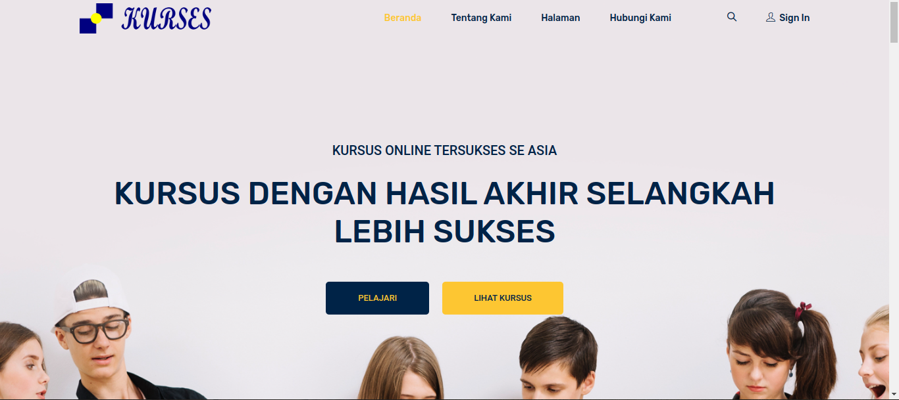
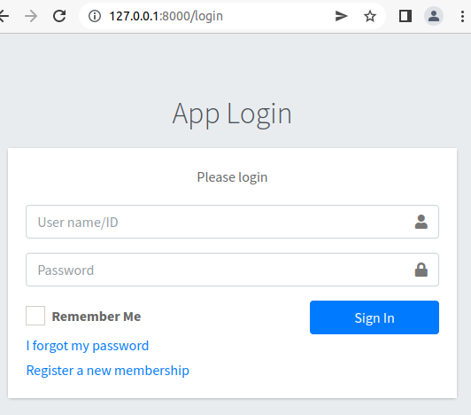
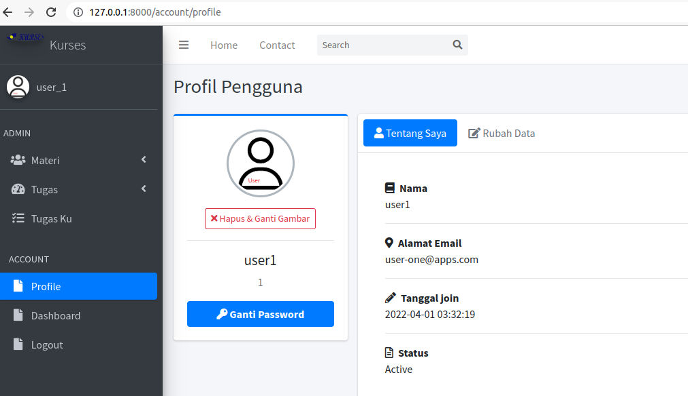
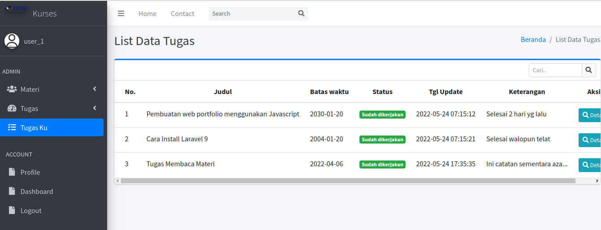
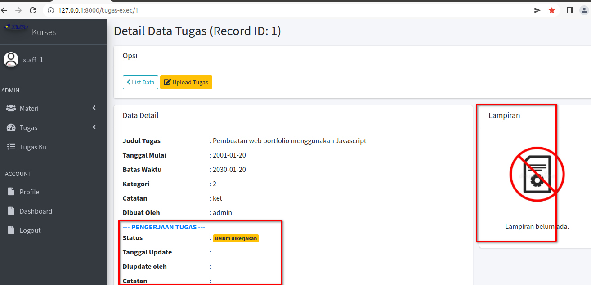
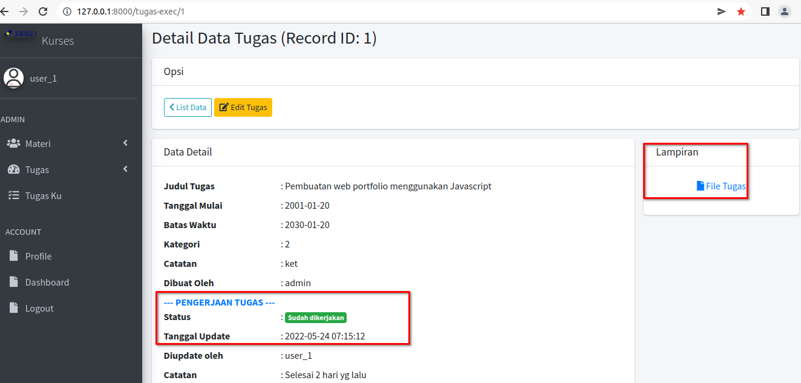
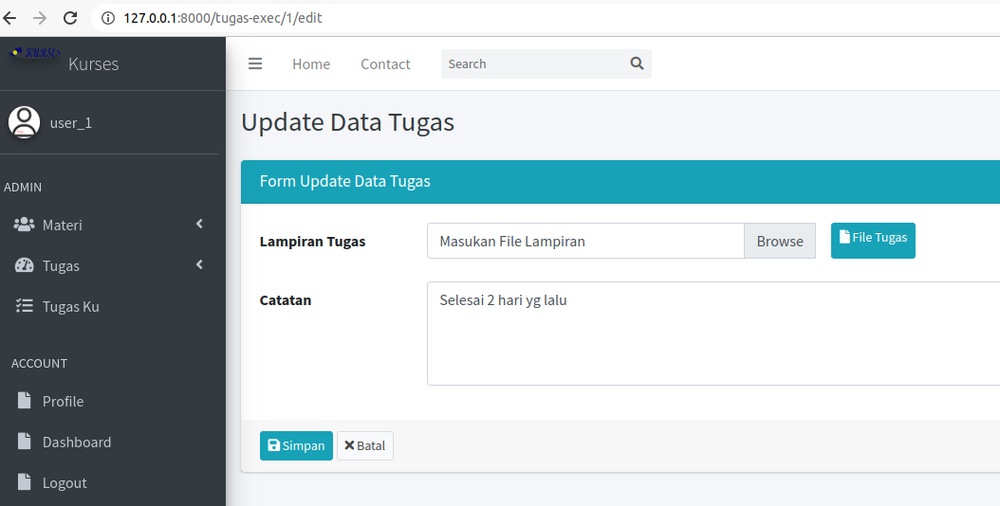
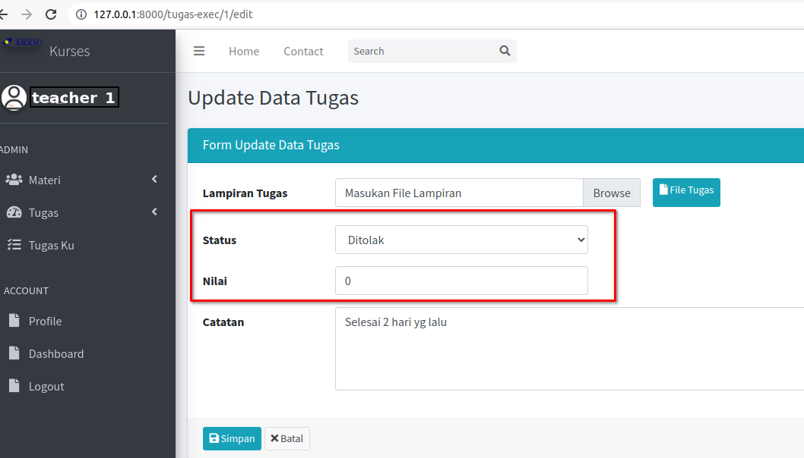

## Projek : Kurses 

Sebuah aplikasi Web Apps utk menyimpan Materi dan Tugas dari hasil pembelajaran antara Guru sbg Pemberi Materi dan Murid sbg Penerima Materi. 
Selanjutnya Guru memberikan Tugas kepada Murid, Tugas dikumpulkan dalam bentuk File dan akan ada koreksi jika Tugas tsb sudah diupload/selesai dikerjakan.

### Lebih Detail:
- Dimulai: Pertengahan Apr-2022
- Dibuat menggunakan PHP Framework: Laravel versi 9.
- Menggunakan DB-MySQL.
- Admin template: AdminLTE3.
- FrontEnd template: EduStage dari ColorLib.
- Login/Logout MultiUser (Admin, Guru, Murid)
- User: admin // pass123
- User: user_1 // pass123
- User: staff_1 // pass123

## Snapshots:

